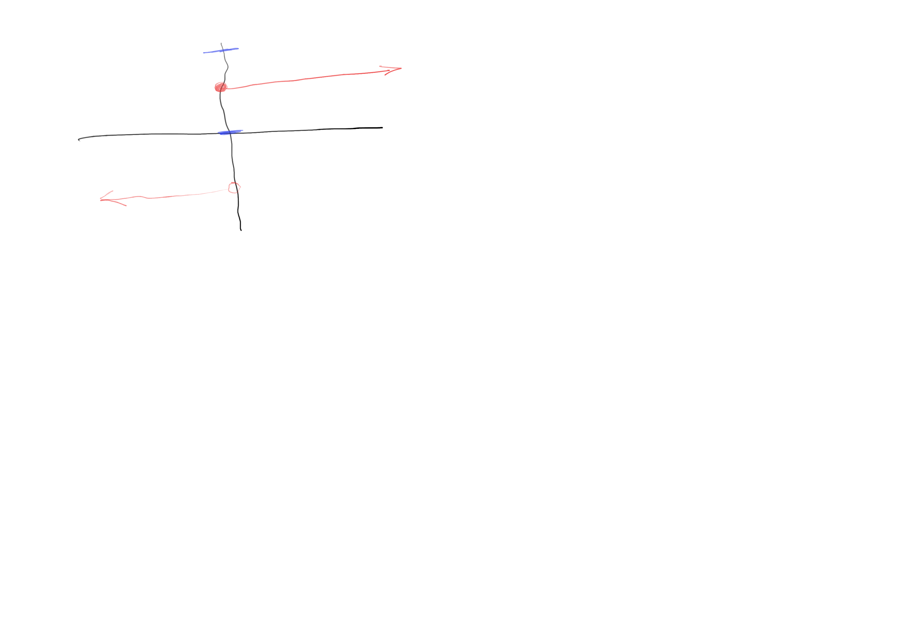

# Topological spaces, continuity, and homeomorphisms

https://www.youtube.com/watch?v=wr0_EF2RBYs&list=PLevbjS885lNS9Nk8ve13FE5tMdZejsTrE&index=1&pp=iAQB0gcJCcUKAYcqIYzv

Inspiration for continuity comes from continues function `R^n -> R^n`

Intuitively A function is continues if "nearby" points are mapped to "nearby" points.
"Nearby" here means lying in a open interval together.
e.g. points "nearby" 2 are of the form (1.9, 2.1)

Definition: A function `R^n -> R^n` is called continuos if the inverse image
of a union of open intervals is a union intervals.

Non-example Let `f(x) = -1 if x < 0, 1 if x >= 0` 

Q: what is f^-1(0, 2) = [0, infinity)
This is not a union of open intervals so f is not continuos.

Example consider f: R -> R f(x) = 2*x
f^-1(a,b) = (a/2, b/2) an open interval. so f  is a continuos function